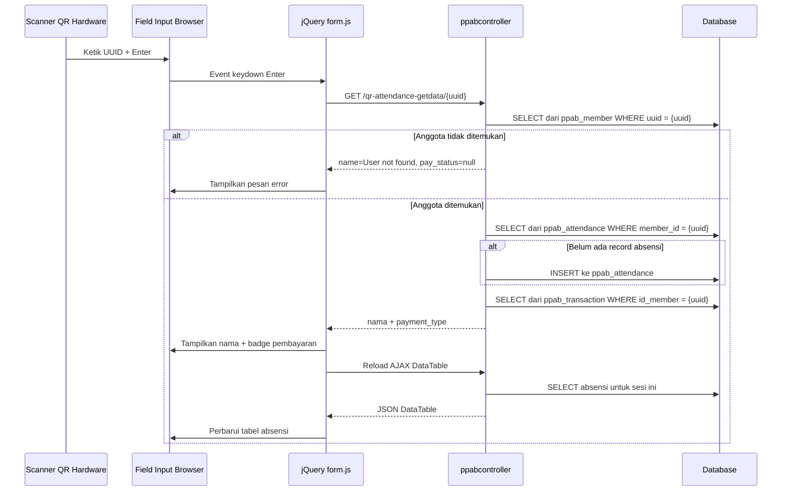

# Arsitektur Fitur ATT-QR — Studi Mendalam

> **Proyek asal**: `app.yiscalazhar.web.id` (panel admin PPAB lama)
> **URL**: `https://app.yiscalazhar.web.id/att-qr`
> **Proyek tujuan**: `app2.yiscalazhar.web.id` (panel admin baru berbasis Filament)

---

## 1. Gambaran Umum

Halaman `/att-qr` adalah **scanner absensi berbasis QR-code** untuk anggota PPAB (Pendidikan Panahan & Akhlak Budi-pekerti). Fitur ini memungkinkan admin/pengajar yang sudah login untuk:

1. Membuka halaman dengan input text yang langsung ter-focus
2. Melakukan scan QR code menggunakan **scanner QR hardware** (barcode reader USB) — scanner mengetikkan UUID ke field input lalu menekan Enter
3. Sistem mencari anggota berdasarkan UUID, membuat record absensi jika belum ada, dan menampilkan nama anggota + status pembayaran
4. DataTable di bagian bawah menampilkan semua peserta yang sudah di-scan secara real-time

Terdapat dua mode:
- **Mode QR Scanner** (`/att-qr`) — scanner hardware menempelkan UUID ke field input
- **Mode Manual** (`/att-manual`) — menampilkan DataTable semua anggota yang sudah bayar dengan tombol Hadir manual

---

## 2. Peta File (Proyek Lama)

### 2.1 Route

**File**: [`routes/web.php`](/www/wwwroot/app.yiscalazhar.web.id/ppab/routes/web.php:56)

```php
// Halaman QR Scanner
Route::get('/att-qr', [ppabcontroller::class, 'scan_attendance']);

// AJAX: cari anggota berdasarkan UUID, buat record absensi
Route::get('/qr-attendance-getdata/{id}', [ppabcontroller::class, 'ajax_get_qr_attendance']);

// AJAX: sumber data DataTable untuk daftar absensi QR
Route::get('/ppab-get-attendance-ajax-qr', [ppabcontroller::class, 'ajax_attendance_ppab_qr']);

// Route absensi manual
Route::get('/att-manual', [ppabcontroller::class, 'manual_attendance']);
Route::get('/ppab-get-attendance-ajax-manual', [ppabcontroller::class, 'ajax_attendance_ppab_manual']);
Route::post('/att-manual-post', [ppabcontroller::class, 'att_manual_post']);
```

Semua route berada dalam middleware group `['auth', 'verified', 'clear_session']`.

### 2.2 Controller

**File**: [`ppabcontroller.php`](/www/wwwroot/app.yiscalazhar.web.id/ppab/app/Http/Controllers/ppab/ppabcontroller.php:385)

#### `scan_attendance()` — Baris 385
Hanya mengembalikan view scanner:
```php
public function scan_attendance()
{
    return view('ppab.attendance.scan.scanner');
}
```

#### `ajax_get_qr_attendance($id)` — Baris 390
Logika inti pemrosesan scan:
```php
public function ajax_get_qr_attendance($id)
{
    $cek = member::where('uuid', $id)->first();
    if (empty($cek)) {
        $response = ['name' => 'User not found', 'pay_status' => null];
    } else {
        if (empty(ppab_attendances::where('member_id', $cek->uuid)->first())) {
            ppab_attendances::create([
                'member_id' => $cek->uuid,
                'session_id' => $cek->id_session,
                'created_at' => Carbon::now()
            ]);
        }
        $response = [
            'name' => $cek->name,
            'pay_status' => getPaymentBasedUUID($id)->payment_type
        ];
    }
    return $response;
}
```

**Perilaku utama:**
- Mencari anggota di tabel `ppab_member` berdasarkan UUID
- Jika tidak ditemukan: mengembalikan pesan error
- Jika ditemukan dan belum ada record absensi: membuat record baru
- Mengembalikan nama anggota + tipe pembayaran (full/dp)
- **Tidak ada pengecekan duplikat per sesi** — hanya mengecek apakah `member_id` ada di tabel absensi secara keseluruhan

#### `ajax_attendance_ppab_qr()` — Baris 423
Sumber data AJAX DataTable untuk menampilkan daftar peserta yang sudah di-scan:
```php
public function ajax_attendance_ppab_qr()
{
    $dt = ppab_session::where('created_at', Auth::user()->id)->first();
    $data = ppab_attendances::where('session_id', empty($dt->uuid) ? null : $dt->uuid)->get();
    return DataTables::of($data)
        ->editColumn('name', fn($data) => getUserDataBasedUuid($data->member_id)->name)
        ->editColumn('gender', fn($data) => ucfirst(getUserDataBasedUuid($data->member_id)->gender))
        ->editColumn('payment_status', fn($data) =>
            getPaymentBasedUUID($data->member_id)->payment_type == 'dp'
                ? 'Down Payment' : 'Full Payment')
        ->editColumn('created_at', fn($data) =>
            Carbon::parse($data->created_at)->format('Y-m-d H:i:s'))
        ->make(true);
}
```

**Catatan**: Terdapat kemungkinan bug — `ppab_session::where('created_at', Auth::user()->id)` seharusnya kemungkinan besar `where('created_by', Auth::user()->id)`.

### 2.3 View — QR Scanner

**File**: [`scanner.blade.php`](/www/wwwroot/app.yiscalazhar.web.id/ppab/resources/views/ppab/attendance/scan/scanner.blade.php:1)

Struktur layout:
- Extends `layouts.app` (template admin lama)
- **Stat cards yang di-comment** untuk jumlah Ticket, Down Payment, Full Payment, Hold
- **Field input UUID**: `<input id="qr-input">` — field teks besar di tengah
- **Area tampilan nama**: `<div id="name">` — menampilkan nama anggota yang di-scan
- **Area status pembayaran**: `<div id="pay_status">` — menampilkan badge Full/DP
- **DataTable**: `<table id="tabel-attendance">` dengan kolom: No, Nama, Gender, Status Pembayaran, Waktu Scan

### 2.4 JavaScript

**File**: [`form.js`](/www/wwwroot/app.yiscalazhar.web.id/script/admin/ppab/scan_attendance/qr/form.js:1)

```javascript
$(document).ready(function () {
    // Inisialisasi DataTable dengan server-side processing
    t = $("#tabel-attendance").DataTable({
        processing: true,
        serverSide: true,
        ajax: "ppab-get-attendance-ajax-qr",
        columns: [
            { data: null, title: "No" },     // penomoran otomatis
            { data: "name" },
            { data: "gender" },
            { data: "payment_status" },
            { data: "created_at" }
        ]
    });

    const qrInput = $("#qr-input");
    qrInput.focus();

    // Selalu menjaga fokus pada field input
    $(document).on("click", function () { qrInput.focus(); });
    qrInput.on("blur", function () { setTimeout(() => qrInput.focus(), 10); });

    // Saat tombol Enter: kirim AJAX untuk mencari UUID
    qrInput.on("keydown", function (event) {
        if (event.key === "Enter") {
            event.preventDefault();
            $.ajax({
                type: 'get',
                url: 'qr-attendance-getdata/' + qrInput.val(),
                success(data) {
                    $("#name").empty().append(data['name']);
                    qrInput.val('');
                    $("#pay_status").empty();
                    if (data['pay_status'] !== null) {
                        t.ajax.reload(); // Refresh DataTable
                        if (data['pay_status'] == 'full') {
                            // Badge hijau: Full Payment
                        } else {
                            // Badge merah: Down Payment
                        }
                    }
                }
            });
        }
    });
});
```

**Perilaku utama:**
- Field input selalu terfokus (untuk scanner hardware)
- Saat Enter: AJAX GET ke `/qr-attendance-getdata/{uuid}`
- Saat sukses: tampilkan nama, badge pembayaran, refresh DataTable
- Input dikosongkan setelah setiap scan

### 2.5 Model

#### Model `member`
**File**: [`member.php`](/www/wwwroot/app.yiscalazhar.web.id/ppab/app/Models/member.php:8)
```php
class member extends Model {
    protected $table = 'ppab_member';
    protected $guarded = ['id'];
}
```
Kolom utama: `id`, `uuid`, `name`, `gender`, `id_session`, `stage`, `email`, dll.

#### Model `ppab_attendances`
**File**: [`ppab_attendances.php`](/www/wwwroot/app.yiscalazhar.web.id/ppab/app/Models/ppab_attendances.php:8)
```php
class ppab_attendances extends Model {
    protected $guarded = ['id'];
    protected $table = 'ppab_attendance';
}
```
Kolom utama: `id`, `member_id` (UUID), `session_id` (UUID), `created_at`.

#### Model `ppab_transaction`
Digunakan melalui helper `getPaymentBasedUUID()`.
Kolom utama: `id_member`, `payment_type` (full/dp), `amount`, `status`, `id_session`.

#### Model `ppab_session`
Kolom utama: `uuid`, `created_by` (user id), `price_full`, `price_dp`.

### 2.6 Fungsi Helper

**File**: [`Helper.php`](/www/wwwroot/app.yiscalazhar.web.id/ppab/app/Helper.php:178)

```php
function getUserDataBasedUuid($id) {
    return member::where('uuid', $id)->first();
}

function getPaymentBasedUUID($id) {
    return ppab_transaction::where('id_member', $id)->first();
}
```

---

## 3. Diagram Alur Data



---

## 4. Perbandingan: Aplikasi Lama vs App2

| Aspek | App Lama - app.yiscalazhar.web.id | App2 - app2.yiscalazhar.web.id |
|-------|-----------------------------------|--------------------------------|
| **Framework** | Laravel + Blade + jQuery | Laravel + Filament 3 + Livewire |
| **Model Absensi** | Tabel `ppab_attendance`: member_id, session_id | Tabel `attendances`: civitas_id, schedule_id, scanned_by_user_id, status |
| **Model Anggota** | Tabel `ppab_member` dengan uuid | `civitas_pendidikans` dengan uuid, terhubung ke MemberPpab atau MemberLama |
| **Sesi/Jadwal** | `ppab_session` dengan uuid, created_by | `education_schedules` dengan uuid |
| **Pelacakan Pembayaran** | `ppab_transaction` dengan payment_type dp/full | Dikelola via sistem pembayaran terpisah |
| **API Scanner** | Hanya web via jQuery AJAX | Endpoint API untuk aplikasi mobile Flutter |
| **Konten QR** | Hanya UUID anggota | Format `civitas_uuid PIPE schedule_uuid` |
| **Autentikasi** | Berbasis session, field level kustom | Filament + Spatie Shield roles |
| **DataTable** | Yajra DataTables server-side | Komponen Tabel Filament |

---

## 5. Referensi Skema Database

### Lama: Tabel `ppab_attendance`
| Kolom | Tipe | Keterangan |
|-------|------|------------|
| id | integer PK | Auto-increment |
| member_id | string/UUID | FK ke ppab_member.uuid |
| session_id | string/UUID | FK ke ppab_session.uuid |
| created_at | timestamp | Waktu scan |

### Baru (App2): Tabel `attendances`
| Kolom | Tipe | Keterangan |
|-------|------|------------|
| id | integer PK | Auto-increment |
| civitas_id | UUID | FK ke civitas_pendidikans.uuid |
| schedule_id | UUID | FK ke education_schedules.uuid |
| scanned_by_user_id | bigint nullable | FK ke users.id |
| status | string | Default: hadir |
| created_at | timestamp | |
| updated_at | timestamp | |

### Lama: Tabel `ppab_member`
| Kolom | Tipe | Keterangan |
|-------|------|------------|
| id_member | integer PK | Auto-increment, juga digunakan sebagai primary key di MemberPpab app2 |
| uuid | string | Identifier unik, digunakan dalam QR code |
| name | string | Nama anggota |
| gender | string | male/female |
| id_session | string/UUID | FK ke ppab_session.uuid |
| stage | string | Tahap registrasi: paid_payment, dll |
| email | string | |

---

## 6. Perbedaan Arsitektur Utama

### 6.1 Format Konten QR Code
- **App lama**: QR berisi **hanya UUID anggota** — contoh: `550e8400-e29b-41d4-a716-446655440000`
- **App2 API**: QR berisi **civitas_uuid|schedule_uuid** — contoh: `aaa-bbb|ccc-ddd`

### 6.2 Cakupan Absensi
- **App lama**: Absensi dicakup berdasarkan **ppab_session** — setiap batch PPAB memiliki satu sesi. Pengecekan duplikat per anggota secara global, bukan per sesi.
- **App2**: Absensi dicakup berdasarkan **education_schedule** — setiap kelas/pertemuan memiliki jadwal unik. Pengecekan duplikat per civitas per jadwal.

### 6.3 Metode Input Scanner
- **App lama**: Scanner QR USB hardware yang berfungsi sebagai keyboard — mengetikkan UUID ke input teks lalu menekan Enter
- **App2**: Aplikasi mobile Flutter dengan scan QR berbasis kamera, memanggil REST API

### 6.4 Tampilan Status Pembayaran
- **App lama**: Menampilkan status pembayaran (Full Payment / Down Payment) saat scan, berdasarkan `ppab_transaction.payment_type`
- **App2**: Tidak ada tampilan status pembayaran dalam alur absensi

---

## 7. Masalah yang Teridentifikasi pada Implementasi Lama

1. **Masalah N+1 Query**: `ajax_attendance_ppab_qr()` memanggil `getUserDataBasedUuid()` dan `getPaymentBasedUUID()` untuk setiap baris — masing-masing melakukan query DB terpisah
2. **Kemungkinan Bug**: `ppab_session::where('created_at', Auth::user()->id)` di baris 425 — kemungkinan besar seharusnya `created_by`
3. **Tidak Ada Scoping Sesi pada Pengecekan Duplikat**: `ajax_get_qr_attendance()` mengecek apakah `member_id` ada di `ppab_attendance` tanpa memfilter berdasarkan `session_id`, sehingga anggota yang sudah hadir di sesi sebelumnya tidak bisa di-scan ulang untuk sesi baru
4. **Tidak Ada Otorisasi Role pada Scan**: Halaman scan dilindungi auth tetapi endpoint AJAX tidak memverifikasi role spesifik
5. **File JS Tidak Ada di Direktori Public Project**: File JS berada di `/www/wwwroot/app.yiscalazhar.web.id/script/` — disajikan dari root domain, bukan dari direktori public Laravel

---

## 8. Referensi Mode Absensi Manual

Untuk kelengkapan, mode absensi manual di `/att-manual`:
- Menampilkan DataTable **semua anggota yang sudah bayar** di sesi saat ini
- Setiap baris memiliki tombol Hadir
- Klik Hadir mengirim POST ke `/att-manual-post` dengan UUID anggota
- Menggunakan `ppab_session::where('created_by', Auth::user()->id)` dengan bypass untuk sysdev

Method controller: [`att_manual_post()`](/www/wwwroot/app.yiscalazhar.web.id/ppab/app/Http/Controllers/ppab/ppabcontroller.php:483)
```php
public function att_manual_post(Request $req)
{
    $cek = member::where('uuid', $req->uuid)->first();
    ppab_attendances::create([
        'member_id' => $cek->uuid,
        'session_id' => $cek->id_session,
        'created_at' => Carbon::now()
    ]);
}
```

---

## 9. Ringkasan

Fitur `/att-qr` lama adalah scanner absensi QR sederhana yang dirancang untuk **barcode reader USB hardware**. Arsitekturnya:
- Satu field input teks dengan fokus persisten
- jQuery AJAX saat tombol Enter untuk memproses UUID yang di-scan
- Pencarian anggota di server → buat record absensi → kembalikan nama + status pembayaran
- Yajra DataTables untuk daftar absensi real-time

Proyek app2 telah mengembangkan konsep ini dengan:
- Tabel `attendances` yang lebih lengkap dengan `civitas_id`, `schedule_id`, dan `scanned_by_user_id`
- REST API untuk aplikasi scanner mobile Flutter
- Tampilan daftar absensi berbasis Filament
- Format QR komposit (`civitas_uuid|schedule_uuid`) untuk absensi spesifik per jadwal
