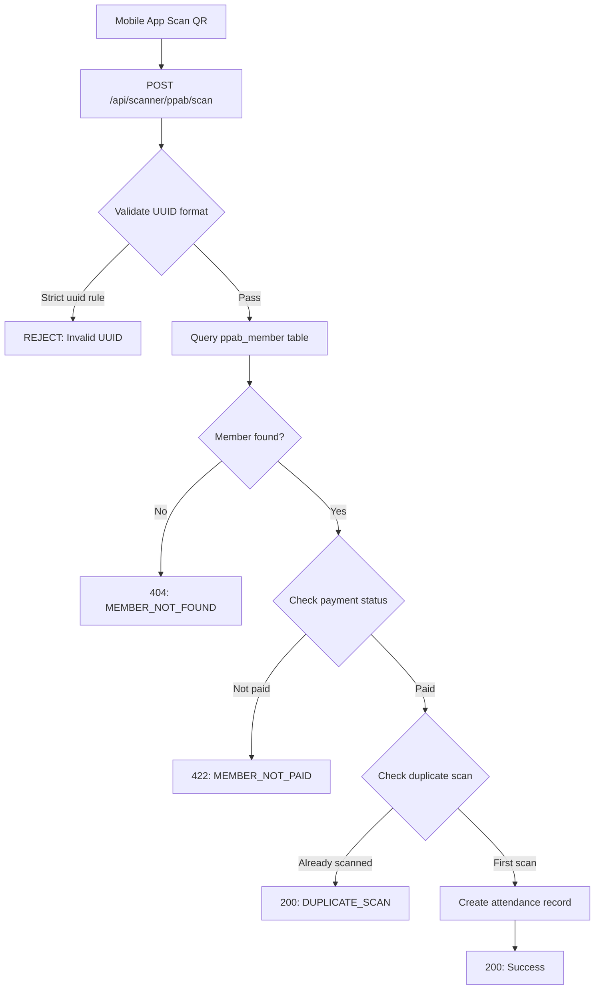

# PPAB Absensi QR Scanner UUID Validation Fix

## Problem Statement

Mobile app cannot scan QR code with UUID: `0be4499c-8b7f-432a-9a5c-efa3650a`

API returns error: "uuid tidak valid" (invalid UUID)

## Root Cause Analysis

**File:** [`app/Http/Controllers/Api/PpabScannerController.php:28`](app/Http/Controllers/Api/PpabScannerController.php#28)

```php
$validated = $request->validate([
    'member_uuid' => 'required|string|uuid',  // ← TOO STRICT
]);
```

### Issue
Laravel's `uuid` validation rule enforces strict RFC 4122 UUID format:
- Must be exactly 36 characters
- Format: `xxxxxxxx-xxxx-4xxx-yxxx-xxxxxxxxxxxx` (8-4-4-4-12 hex segments)

The scanned UUID `0be4499c-8b7f-432a-9a5c-efa3650a` has:
- Only 32 hex characters (missing 2 in last segment)
- Last segment: 10 chars (should be 12)
- Does NOT match strict UUID v4 format

### Why This Happens
Two possible scenarios:
1. **Database stores truncated UUIDs** - ppab_member.uuid column contains the truncated value
2. **QR generation bug** - Full UUID exists in DB but QR was generated wrong

## Current Flow



## Current Duplicate Prevention

Located at [`app/Http/Controllers/Api/PpabScannerController.php:79-81`](app/Http/Controllers/Api/PpabScannerController.php#79):

```php
$alreadyScanned = PpabAttendance::where('member_id', $memberUuid)
    ->where('session_id', $sessionUuid)
    ->exists();
```

**Works correctly:** Prevents same member_id + session_id combination from being saved twice.

## Proposed Solution

### Option 1: Remove Strict UUID Validation (RECOMMENDED)
Change validation to accept any non-empty string, let database query handle actual validation.

**Pros:**
- Works with any UUID format (truncated, full, custom)
- Database already validates via WHERE clause
- No breaking changes needed
- Follows YAGNI principle

**Cons:**
- Accepts any string (but database query filters invalid values anyway)

### Option 2: Custom UUID Validation
Create custom regex that accepts both standard and truncated UUIDs.

**Pros:**
- More explicit validation
- Catches some malformed inputs before DB query

**Cons:**
- Adds complexity
- May break if UUID format changes again
- Overengineering for simple DB lookup

## Implementation Plan

### Step 1: Fix Validation Rule
**File:** [`app/Http/Controllers/Api/PpabScannerController.php:28`](app/Http/Controllers/Api/PpabScannerController.php#28)

**Before:**
```php
$validated = $request->validate([
    'member_uuid' => 'required|string|uuid',
]);
```

**After:**
```php
$validated = $request->validate([
    'member_uuid' => 'required|string|max:255',
]);
```

**Rationale:** 
- Database query at line 36 handles actual validation
- If UUID not found, returns proper 404 error
- Duplicate prevention remains intact (lines 79-81)

### Step 2: Verify Behavior

Test cases needed:
1. ✅ Valid full UUID: `0be4499c-8b7f-432a-9a5c-efa3650a1234` 
2. ✅ Truncated UUID: `0be4499c-8b7f-432a-9a5c-efa3650a`
3. ✅ Non-existent UUID: Returns 404 with `MEMBER_NOT_FOUND`
4. ✅ Duplicate scan: Returns 200 with `DUPLICATE_SCAN`
5. ✅ Unpaid member: Returns 422 with `MEMBER_NOT_PAID`

### Step 3: Check Database (Investigation Required)

Run query to check actual UUID format in ppab_member:

```sql
SELECT uuid, LENGTH(uuid), name 
FROM ppab_member 
WHERE uuid LIKE '0be4499c-8b7f-432a-9a5c-efa3650a%'
LIMIT 5;
```

This confirms whether:
- UUID in DB is actually truncated → QR is correct, validation just too strict
- UUID in DB is full → QR generation has bug (needs separate fix)

## Security Considerations

**Current protection layers:**
1. ✅ Database lookup validates UUID exists
2. ✅ Payment status check prevents unpaid access
3. ✅ Duplicate prevention via unique constraint check
4. ✅ Session validation ensures correct PPAB period

**After fix:**
- All protection layers remain intact
- Only validation rule changes (string instead of uuid format)
- Database acts as final validator

## Testing Checklist

- [ ] Scan truncated UUID: `0be4499c-8b7f-432a-9a5c-efa3650a` → Should work
- [ ] Scan same UUID twice → Should return `DUPLICATE_SCAN`
- [ ] Scan invalid/random string → Should return `MEMBER_NOT_FOUND`
- [ ] Scan unpaid member UUID → Should return `MEMBER_NOT_PAID`
- [ ] Verify attendance record saved correctly in ppab_absen table

## Files to Modify

1. [`app/Http/Controllers/Api/PpabScannerController.php`](app/Http/Controllers/Api/PpabScannerController.php) - Line 28

## Rollback Plan

If issues occur, revert single line change:
```php
'member_uuid' => 'required|string|uuid',  // Restore strict validation
```

## Related Documentation

- API Route: [`routes/api.php:46`](routes/api.php#46) - `POST /api/scanner/ppab/scan`
- Model: [`app/Models/PpabParticipant.php`](app/Models/PpabParticipant.php)
- Database: `ppab` connection, `ppab_member` table
- Duplicate check: `ppab_absen` table (member_id + session_id unique)
