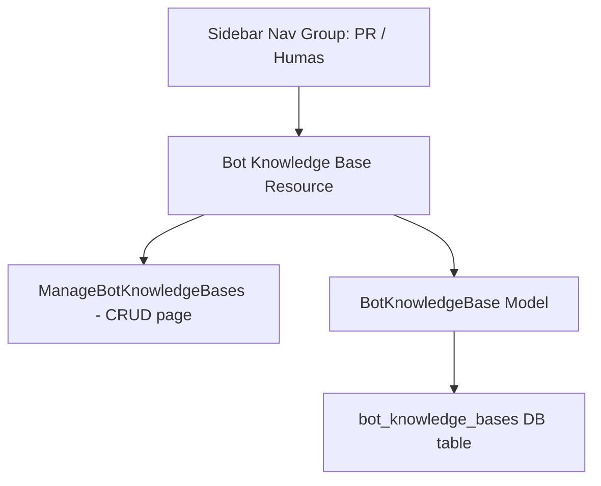

# Bot Knowledge Base - PR / Humas Menu Plan (Updated)

## Summary

Make "PR / Humas" a **top-level Filament navigation group header** (like "Pendidikan" or "Super Admin") and place "Bot Knowledge Base" resource under it as a child menu item.

## Current State (Already Done)
- Migration, Model, Resource, Policy, Shield permissions — all created and functional
- PrHumasMenu page exists (will be deleted — no longer needed)
- BotKnowledgeBaseResource has `$navigationGroup = 'Super Admin'` (will be changed)

## Architecture



## Changes Required

### 1. BotKnowledgeBaseResource.php
- Change `$navigationGroup` from `'Super Admin'` to `'PR / Humas'`

### 2. Delete PrHumasMenu.php
- The page is no longer needed since "PR / Humas" will be a native Filament navigation group header, not a nested sidebar page

### 3. AdminPanelProvider.php
- **Add** `NavigationGroup::make()->label('PR / Humas')->collapsible(true)` to `->navigationGroups()`
- **Remove** `"PR / Humas": ["Bot Knowledge Base"]` from the sidebar JS config (no nesting needed; standard nav group behavior)

### 4. Cache clear
- Run `php artisan optimize:clear`

## Result
The sidebar will show:
```
▼ PR / Humas        ← Nav group header (collapsible)
   Bot Knowledge Base  ← Resource link
```
