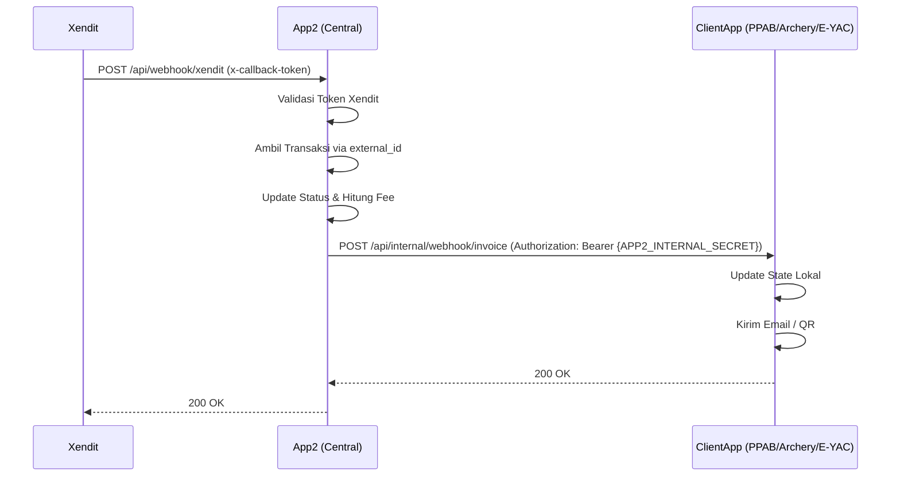

# App2 Xendit Webhook Central Gateway Implementation Plan

## 1. Overview & Objective
Tujuan dari plan ini adalah untuk membangun **Centralized Xendit Webhook Gateway** di `app2`. 
`app2` akan menjadi satu-satunya entry point bagi webhook dari Xendit (Invoice PAID, SETTLED, EXPIRED, dll). 
Setelah `app2` menerima webhook, sistem akan:
1. Memvalidasi callback token dari Xendit.
2. Memperbarui status transaksi di database terpusat (`app2`).
3. Menghitung secara dinamis pembagian fee (`fee_pg`, `fee_sysdev`, `withdrawable`).
4. Meneruskan (forward) status ke aplikasi klien masing-masing menggunakan mekanisme **Internal Webhook** dengan pengamanan **Static Bearer Token** (satu token shared untuk semua child app di server yang sama).

## 2. Arsitektur Alur Webhook


## 3. Detail Implementasi di `app2`

### A. Routes (`routes/api.php`)
Menambahkan endpoint publik yang didaftarkan ke dashboard Xendit:
```php
Route::post('/webhook/xendit/invoice', [XenditWebhookController::class, 'handleInvoice']);
```

### B. Controller (`XenditWebhookController.php`)
Controller ini akan menangani logika inti:
1. **Verifikasi Keamanan:** Cek header `x-callback-token` sesuai `.env`.
2. **Ekstraksi Data & Identifikasi Aplikasi:** Ambil `external_id`, lalu deteksi awalan (prefix)-nya untuk menentukan tabel mana yang harus di-query:
   - Jika `external_id` berawalan `PPAB`, maka aplikasi = `PPAB` dan tabel target = `ppab_transactions_xendit`.
   - Jika `external_id` berawalan `ARCHERY`, maka aplikasi = `ARCHERY` dan tabel target = `archery_transactions_xendit`.
   - Jika `external_id` berawalan `YAC` / `EYAC`, maka aplikasi = `EYAC` dan tabel target = (tabel transaksi E-YAC di `app2`).
3. **Cari Transaksi:** Lakukan query update ke database `app2` pada **tabel spesifik** yang telah diidentifikasi di langkah 2 menggunakan `external_id` tersebut.
4. **Perhitungan Fee (Dinamis):**
   - Berdasarkan `payment_method` (QR_CODE, BANK_TRANSFER, RETAIL_OUTLET).
   - Hitung `fee_pg` sesuai policy Xendit.
   - Ambil `fee_sysdev` dari konfigurasi yang sudah di-setup (misal `paymentgatewayfees`).
   - Hitung `withdrawable = amount - fee_pg - fee_sysdev`.
5. **Update Database:** Simpan data `status`, `paid_at`, fee, dll ke dalam transaksi.
6. **Forward Webhook:**
   - Cek routing prefix dari `external_id` untuk menentukan URL child app tujuan.
   - Kirim `Http::post` ke internal webhook child app dengan header:
     ```php
     Http::withToken(config('services.internal.secret'))
         ->post($url, $payload);
     ```

### C. Konfigurasi Environment (`.env` di `app2`)
```env
XENDIT_WEBHOOK_TOKEN=your_xendit_webhook_verification_token

# Shared secret untuk semua child app di server ini.
# Satu token untuk semua — karena semua masih 1 server (loopback, trusted network).
# Generate dengan: openssl rand -hex 32
APP2_INTERNAL_SECRET=your-shared-secret-here

# URL Routing Aplikasi Klien (tetap per-app, tapi cukup satu secret)
INTERNAL_WEBHOOK_URL_PPAB=https://join-ppab.yiscalazhar.web.id/api/internal/webhook/invoice
INTERNAL_WEBHOOK_URL_ARCHERY=https://archery.yiscalazhar.web.id/api/internal/webhook/invoice
INTERNAL_WEBHOOK_URL_EYAC=https://e-yac.yiscalazhar.web.id/api/internal/webhook/invoice
```

### D. Konfigurasi `config/services.php` di `app2`
```php
'internal' => [
    'secret' => env('APP2_INTERNAL_SECRET'),
],
```

### E. Logika Verifikasi di Sisi Child App
Child app memvalidasi request dari app2 dengan:
```php
if ($request->bearerToken() !== config('services.app2.secret')) {
    return response()->json(['message' => 'Unauthorized'], 401);
}
```
Di mana `APP2_INTERNAL_SECRET` di `.env` child app **harus sama persis** dengan nilai di app2.

## 4. Persiapan Sebelum Memulai (Checklist)
- [ ] Pastikan model/tabel untuk Fee Gateway (seperti `paymentgatewayfees`) sudah siap dan bisa di-query di `app2`.
- [ ] Pastikan tabel transaksi utama (seperti `ppab_transactions_xendit`) sudah ter-migrate dan berisi kolom fee (`fee_pg`, `withdrawable`, `fee_sysdev`, dll).
- [ ] Siapkan Class Helper atau Service di `app2` untuk melakukan perhitungan fee agar Controller tetap bersih.
- [ ] Generate shared secret: `openssl rand -hex 32` dan distribusikan ke semua `.env` yang relevan.

## 5. Langkah Selanjutnya
Saat kamu pindah ke workspace `app2` dan memanggilku, kita akan:
1. Membuat/memodifikasi tabel transaksi dan fee jika diperlukan.
2. Membuat `XenditWebhookController.php`.
3. Menulis Service untuk perhitungan Fee Dinamis.
4. Menghubungkan Routing dari `routes/api.php` dan melakukan testing simulasi webhook.
